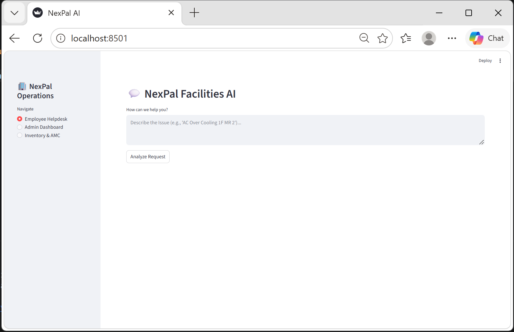
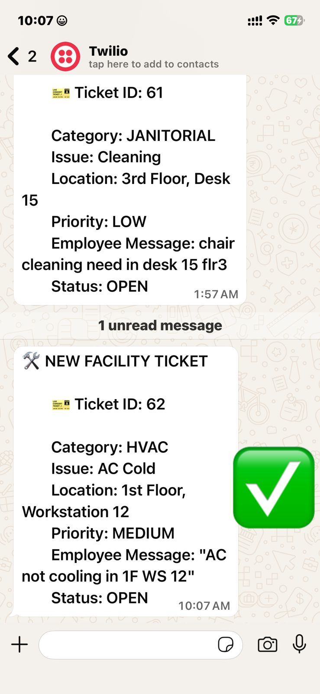
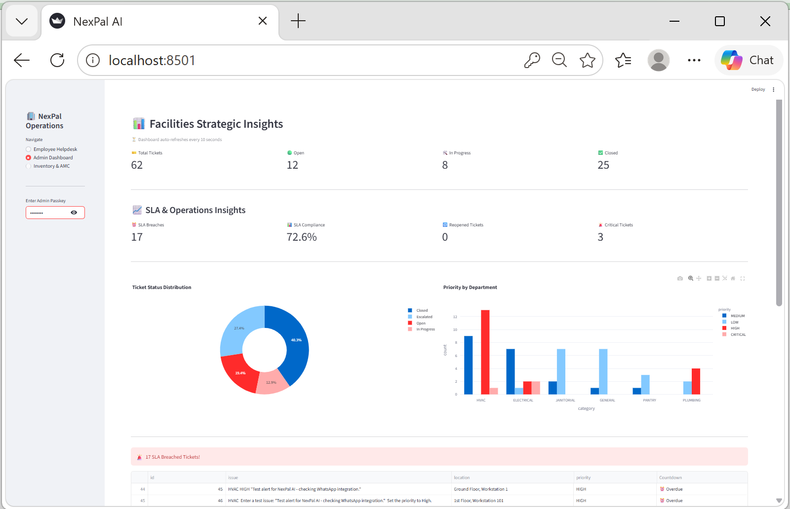
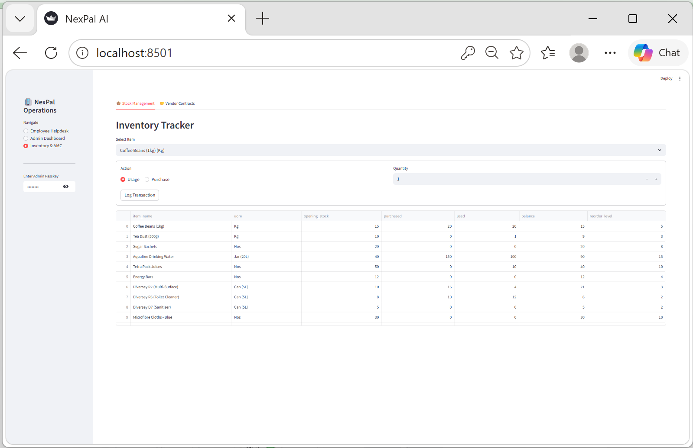
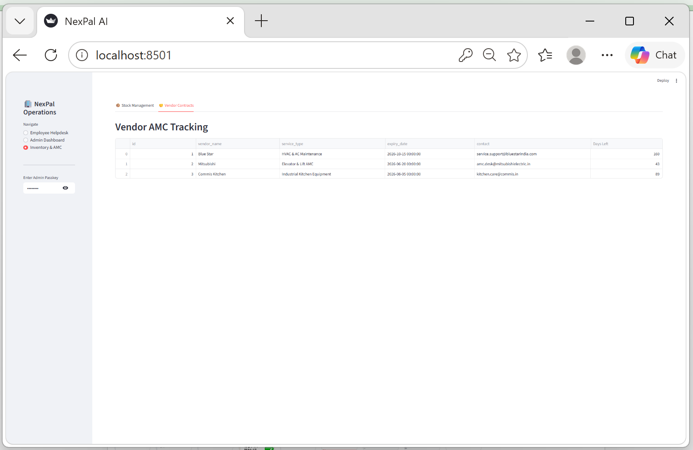

# 🚀 NexPal – AI-Powered Facilities Workflow & SLA Management System

> Intelligent Facilities Operations Automation using Generative AI, SLA Monitoring, and WhatsApp Integration

---

# 📌 Project Overview

NexPal is an AI-powered Facilities Management Platform designed to automate complaint handling, ticket routing, SLA monitoring, escalation workflows, operational insights, and vendor/inventory tracking.

The platform leverages **OpenAI GPT-4o** to intelligently analyze employee complaints, classify issues, assign priorities, identify locations, and automatically route tickets to the correct service department.

The system also integrates **WhatsApp notifications** for real-time service communication and SLA breach escalation alerts.

---

# 🎯 Key Objectives

✅ Reduce manual ticket triaging  
✅ Improve SLA compliance visibility  
✅ Automate service team communication  
✅ Enable real-time operational monitoring  
✅ Streamline facilities workflow management  

---

# 🧠 Core Features

## 🤖 AI Complaint Analysis
- Natural language complaint understanding
- Automatic category classification
- Smart issue prioritization
- Location extraction & formatting

## 🎫 Intelligent Ticket Management
- Automated ticket creation
- Department-based routing
- Real-time ticket tracking
- Ticket lifecycle management

## ⏳ SLA Monitoring Engine
- Live SLA countdown timer
- Overdue ticket detection
- Automatic escalation workflow
- SLA compliance insights

## 📲 WhatsApp Notification System
- Service team ticket alerts
- Real-time escalation notifications
- Admin SLA breach alerts
- Twilio WhatsApp integration

## 📊 Strategic Admin Dashboard
- Complaint analytics
- Priority trend visualization
- SLA performance tracking
- Operational KPI monitoring

## 📦 Inventory Management
- Material stock tracking
- Usage & purchase logging
- Low stock alerts
- Consumption monitoring

## 🤝 Vendor AMC Lifecycle Tracking
- Contract expiry monitoring
- Vendor renewal alerts
- AMC performance visibility

---

# 🏗️ System Workflow

```text
Employee Complaint
        ↓
AI Complaint Analysis (GPT-4o)
        ↓
Category & Priority Detection
        ↓
Automatic Department Routing
        ↓
WhatsApp Notification to Service Team
        ↓
SLA Timer Activation
        ↓
Real-Time Dashboard Monitoring
        ↓
SLA Breach Escalation (if overdue)
        ↓
Ticket Resolution & Closure
```

---

# 📸 System Screenshots

## 🖥️ Employee Helpdesk Interface



---

## 📲 WhatsApp Ticket Notification



---

## 📊 Admin Dashboard



---

## 📦 Inventory & Vendor Management



---

## 🤝 Vendor AMC Tracking



---

# ⚙️ Technology Stack

| Layer | Technology |
|---|---|
| Frontend UI | Streamlit |
| Backend | Python |
| Database | SQLite |
| AI Engine | OpenAI GPT-4o |
| Messaging | Twilio WhatsApp API |
| Visualization | Plotly |
| Data Processing | Pandas |

---

# 🚀 Installation & Execution

## 1️⃣ Install Dependencies

```bash
pip install -r requirements.txt
```

## 2️⃣ Run the Application

```bash
streamlit run app.py
```

---